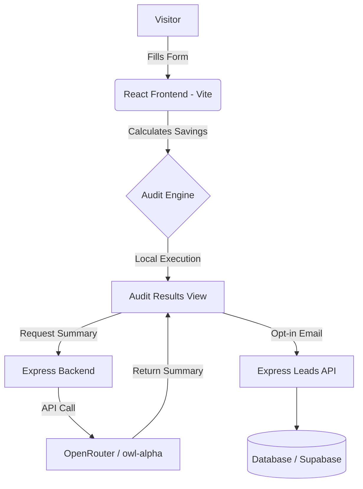

# Architecture Decisions & Rationale

**1-Sentence Summary**: SpendScope is a deterministic, client-heavy React application with a lightweight Express backend that proxies LLM requests, persisting nothing until the user opts in.

## System Diagram

## Data Flow
1. User inputs current tools, seats, and monthly spend into the frontend form.
2. The form state is persisted via `localStorage` so they don't lose data on refresh.
3. Upon submission, the deterministic `auditEngine.ts` evaluates the input against hardcoded pricing rules.
4. The frontend calculates potential savings and recommended actions.
5. The frontend sends the results to our Express backend, which securely queries OpenRouter (`openrouter/owl-alpha`) to generate a personalized executive summary.
6. The user views the result. If they see enough value, they input their email, which fires a POST to the backend to capture the lead.

## Why We Chose This Stack
The assignment permitted multiple frameworks (React, Next.js, Vue, etc.). We actively chose to pivot from a Next.js full-stack approach to a **Vite + React SPA with an Express backend** for three reasons:

1. **Separation of Concerns**: By splitting the backend from the frontend, we avoid tying ourselves to Vercel's serverless ecosystem. We can deploy the frontend to Cloudflare Pages (for global edge caching) and run the backend on a dedicated instance.
2. **Deterministic Execution**: The entire audit logic requires no database lookups or heavy compute. Running the `auditEngine` purely on the client side makes the app feel instant and offloads compute from our servers.
3. **Security**: We needed a secure way to hold the `OPENROUTER_API_KEY`. The lightweight Express backend acts purely as a secure proxy and lead capture endpoint, keeping the frontend bundle small and secure.

## Scaling to 10k Audits/Day
If this hits 10k audits a day:
- The React frontend handles it effortlessly (it's just static files on a CDN).
- The Express backend would bottleneck on the OpenRouter API requests. We would implement Redis-based prompt caching. Since many users might input identical stacks (e.g., Cursor Pro + ChatGPT Plus), we could cache the generated summaries based on a hash of the `AuditFormData` to avoid redundant LLM calls.
